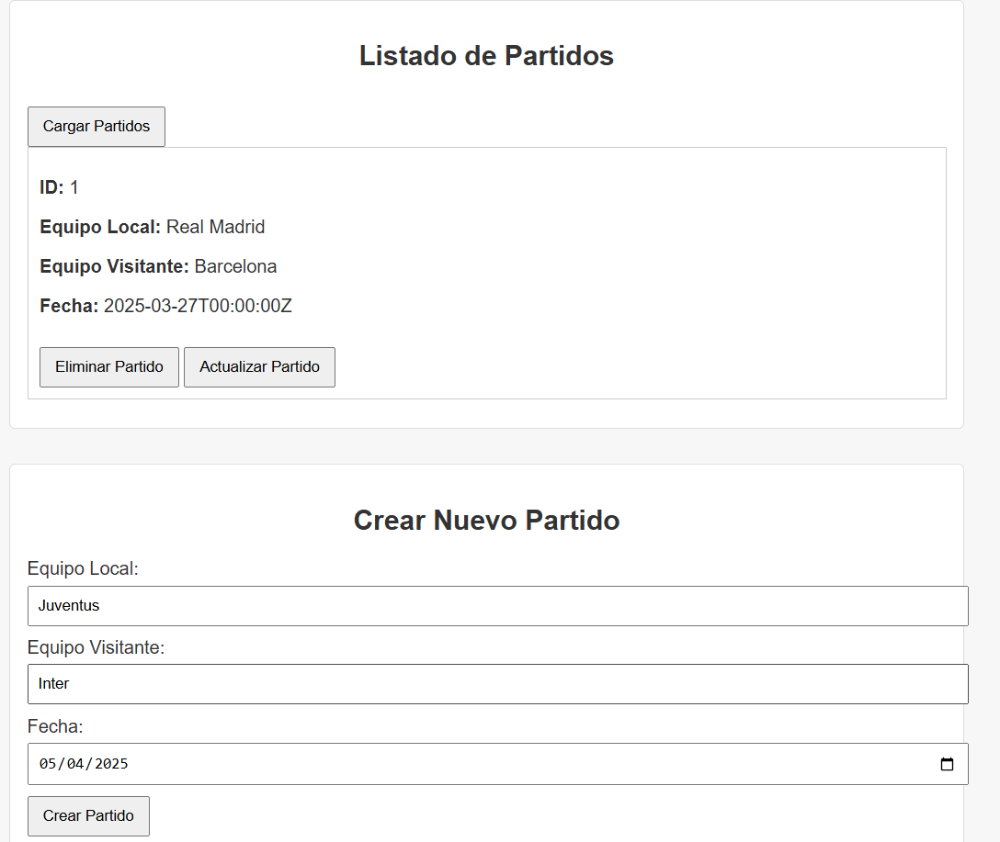
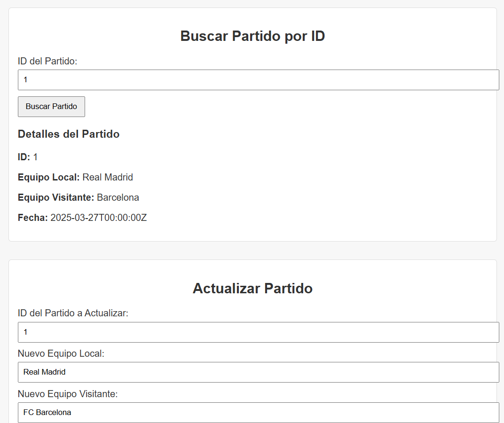
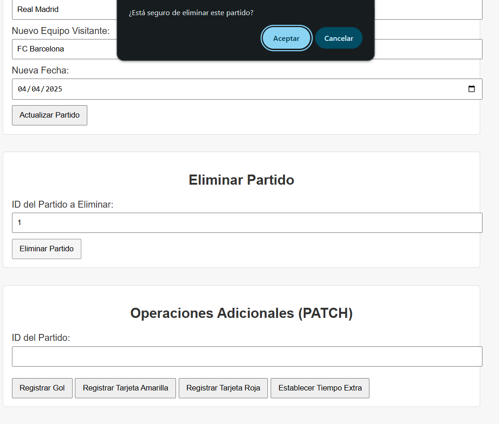

# **La Liga Tracker**

⚽ **La Liga Tracker** es una API construida utilizando **Go** y **PostgreSQL** que permite gestionar partidos de fútbol.





---

## 🔍 Características Principales

- **Gestión de Partidos**: Permite realizar operaciones CRUD (Crear, Leer, Actualizar, Eliminar) en los partidos de fútbol registrados.
- **Base de Datos PostgreSQL**: Utiliza PostgreSQL como sistema de gestión de bases de datos para un almacenamiento seguro y escalable.
- **CORS Habilitado**: Esta API permite solicitudes desde diferentes dominios gracias al soporte de CORS.

---

## 🛠️ Tecnologías Empleadas

- **Backend**: Desarrollado con Go y el framework Gin para una implementación rápida y eficiente de la API.
- **Base de Datos**: PostgreSQL, garantizando un manejo de datos robusto y eficiente.
- **Servidor Web**: Utiliza Gin, junto con CORS habilitado para permitir el acceso a la API desde diferentes orígenes.

---

## 🚀 Funciones

- **Crear Partido**: Permite agregar nuevos partidos a la base de datos.
- **Ver Partidos**: Consulta todos los partidos o busca un partido específico por su ID.
- **Actualizar Partido**: Modifica la información de un partido existente.
- **Eliminar Partido**: Elimina un partido de la base de datos.
- **Aztualizar Goles**: Actualizar los goles de un partido de la base de datos.
- **Aztualizar Tarjetas Amarillas**: Actualizar las tarjetas amarillas de un partido de la base de datos.
- **Aztualizar Tarjetas Rojas**: Actualizar las tarjetas rojas de un partido de la base de datos.
- **Aztualizar Tiempo Extra**: Actualizar el tiempo extra de un partido de la base de datos.


---

## 📜 Instalación y Uso

### 1. Clona el repositorio


```bash
git clone https://github.com/hadelacruz/Lab6_Backend.git

 ```

### 2. Levantar el proyecto

```bash

docker-compose up --build
 ```

---

## 📡 Enlace a la colección de Postman

```bash

https://laligatracker.postman.co/workspace/My-Workspace~7097b7bc-952d-4d7c-8a5f-3f6153627853/collection/30659003-62de1276-1eb1-469b-a702-0093d6d0a4f1?action=share&creator=30659003

 ```